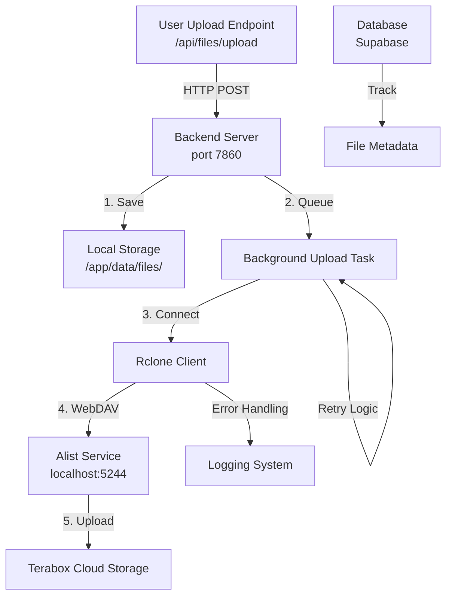
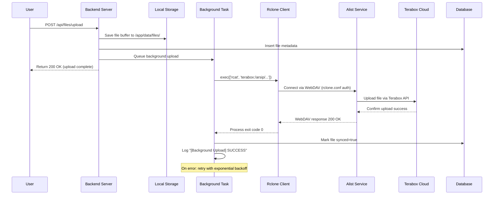

# Design Document: Alist Storage Integration Fix

## Overview

This design addresses the broken file sync to Terabox via Alist WebDAV. Currently, files upload to local storage but fail to backup to Terabox because:
1. **Alist service is unreachable** (`http://localhost:5244/` returns connection errors)
2. **Rclone WebDAV authentication fails** (gzip header errors, 401 Unauthorized)
3. **Backup tasks fail silently** without clear error logging or retry logic
4. **Files are not persistent** across Cloud Run restarts

This design provides:
- **Alist initialization** with proper startup and health checks
- **Rclone WebDAV authentication** using rclone.conf configuration
- **Reliable background uploads** with exponential backoff retry
- **File persistence** using Cloud Run persistent storage or Terabox as single source of truth
- **Comprehensive error logging** and monitoring

---

## Architecture



### Data Flow Sequence



---

## Components and Interfaces

### 1. Alist Service Component

**Purpose**: Run Alist daemon in Docker container, expose WebDAV endpoint for Rclone connection.

**Configuration**:
- **Binary**: `alist/alist.exe` (Windows) or `alist` (Linux/Cloud Run)
- **Port**: `5244` (exposed in Dockerfile)
- **Data Directory**: `alist/data/` (persisted)
- **Config File**: `alist/data/config.json` (Terabox credentials stored here)
- **Health Check**: `GET http://localhost:5244/` → 200 OK or redirect to Web UI

**Interface**:
```javascript
interface AlistService {
  // Start the Alist daemon during container initialization
  start(): Promise<void>
  
  // Check if Alist is running and responding
  healthCheck(): Promise<{status: 'healthy' | 'unhealthy', uptime: number}>
  
  // Get Alist admin login status
  getAdminStatus(): Promise<{authenticated: boolean}>
  
  // Fetch Alist configuration (mount points, storage providers)
  getSettings(): Promise<{mounts: Array, storage: Object}>
}
```

**Key Responsibilities**:
- Run as daemon process during container startup
- Listen on WebDAV endpoint `/dav/terabox` (configured in config.json)
- Mount Terabox account via cloud storage provider API
- Authenticate incoming Rclone connections

**Error Handling**:
- If Alist fails to start: log error, exit container with status 1
- If Alist crashes during runtime: restart with exponential backoff
- If WebDAV mount fails: log configuration error, provide diagnostic endpoint

---

### 2. Rclone WebDAV Client Component

**Purpose**: Connect to Alist WebDAV endpoint, upload files to Terabox via background tasks.

**Configuration**:
```
[terabox]
type = webdav
url = http://localhost:5244/dav/terabox
vendor = other
user = admin
pass = admin123
```

**Interface**:
```javascript
interface RcloneClient {
  // Upload file buffer to remote storage
  uploadDirect(
    fileBuffer: Buffer, 
    filename: string, 
    storagePath: string
  ): Promise<{storagePath, size}>
  
  // List files at remote path
  listFiles(path: string): Promise<Array<{Name, Size, ModTime}>>
  
  // Create directory at remote path
  mkdir(path: string): Promise<void>
  
  // Delete file from remote
  deleteFile(path: string): Promise<void>
  
  // Check if file exists
  checkFileExists(path: string): Promise<boolean>
}
```

**Key Responsibilities**:
- Execute Rclone child processes with proper configuration
- Handle WebDAV authentication via rclone.conf
- Parse Rclone output and error messages
- Manage directory creation and file operations
- Stream large files efficiently

**Error Handling**:
- Catch Rclone exit code non-zero: parse stderr, identify error type
- Handle "gzip: invalid header": indicates Alist WebDAV misconfiguration (likely TLS/protocol issue)
- Handle "401 Unauthorized": invalid credentials in rclone.conf
- Handle "Connection refused": Alist service unreachable (port 5244 not responding)

---

### 3. Background Upload Task Component

**Purpose**: Reliably backup uploaded files to Terabox with retry logic and error logging.

**Interface**:
```javascript
interface BackgroundUploadTask {
  // Queue a file for background upload
  queueUpload(
    fileBuffer: Buffer,
    filename: string,
    zonaKode: string,
    tokoKode: string,
    category: string
  ): Promise<{storagePath, queued: boolean}>
  
  // Execute background upload with retry logic
  executeUpload(
    storagePath: string,
    maxRetries: number
  ): Promise<{status: 'success' | 'failed', attempts: number}>
}
```

**Key Responsibilities**:
- Start upload task asynchronously after file saved locally
- Implement exponential backoff retry: delays 5s → 10s → 20s → 40s
- Max retry attempts: 3 for transient errors, 1 for permanent errors
- Log each attempt with timestamp, filename, retry count, error type
- Update database with sync status and error details
- Never block the main upload endpoint response

**Error Handling**:
- **Transient Errors** (retry):
  - Connection timeout: `Error: ETIMEDOUT`
  - Temporary service unavailable: `Error: ECONNREFUSED`
  - Network errors: `Error: EAI_AGAIN`, `Error: EHOSTUNREACH`
- **Permanent Errors** (single attempt):
  - Authentication failure: `401 Unauthorized`
  - Rclone configuration error: bad path, wrong remote name
  - File already exists conflict (ignore, continue)
- **Log Format**: `[Background Upload] ATTEMPT {n} for {filename}: {status}`

---

### 4. File Persistence Component

**Purpose**: Ensure files survive Cloud Run restarts by persisting to either local storage or treating Terabox as single source of truth.

**Storage Strategy**:
- **Primary**: Store in local `/app/data/files/` during development
- **Cloud Run**: Mount persistent volume (`/app/data/`) to persist files across deployments
- **Terabox as Backup**: All files automatically synced to Terabox (redundancy)

**Interface**:
```javascript
interface FilePersistence {
  // Save file to persistent storage
  saveFile(
    filename: string,
    buffer: Buffer,
    metadata: Object
  ): Promise<{path, size, persisted: boolean}>
  
  // List all persisted files with metadata
  listPersisted(): Promise<Array<{name, size, uploadedAt, synced}>>
  
  // Verify file is readable after save
  verifyPersistence(filename: string): Promise<boolean>
}
```

**Key Responsibilities**:
- Write files to persistent volume on Cloud Run
- Handle write failures gracefully (log, retry, or queue for later)
- Verify file is readable immediately after write
- Track file sync status in database
- Support recovery of partially synced files on restart

---

### 5. Error Handling and Logging Strategy

**Centralized Error Logger**:
```javascript
class StorageErrorLogger {
  // Log operation with context
  logOperation(operation: string, details: Object): void
  
  // Log error with retry context
  logError(operation: string, error: Error, context: Object): void
  
  // Track error patterns for alerting
  trackErrorPattern(errorType: string, threshold: number): void
}
```

**Error Categories**:

| Category | Error Code | Root Cause | Recovery |
|----------|-----------|-----------|----------|
| **Alist Startup** | `ALIST_START_FAILED` | Port 5244 in use, permission denied, config error | Retry with backoff, clear port, fix config |
| **Alist Unreachable** | `ALIST_UNREACHABLE` | Service crashed, network issue, wrong URL | Health check endpoint, auto-restart |
| **WebDAV Auth** | `WEBDAV_AUTH_FAILED` | Wrong credentials, invalid rclone.conf | Log credentials source, verify config |
| **Rclone Upload** | `RCLONE_UPLOAD_FAILED` | Connection timeout, file not found, quota exceeded | Retry with exponential backoff, notify user |
| **Gzip Header Error** | `GZIP_INVALID_HEADER` | Alist returning non-WebDAV response (HTML error page) | Verify Alist started correctly, check port |
| **File Not Persisted** | `FILE_WRITE_FAILED` | Disk full, permission denied, volume unmounted | Alert ops, fallback to temp storage |

**Log Output Format**:
```json
{
  "timestamp": "2024-01-15T10:30:45.123Z",
  "level": "ERROR",
  "operation": "Background Upload",
  "filename": "invoice-001.pdf",
  "storagePath": "/arsip/zona-01/toko-a/PPN/invoice-001.pdf",
  "errorType": "RCLONE_UPLOAD_FAILED",
  "errorMessage": "Connection refused: 127.0.0.1:5244",
  "attempt": 2,
  "maxRetries": 3,
  "nextRetryIn": "10s",
  "sourceFile": "backend/rclone_wrapper.js:123"
}
```

---

## Data Models

### File Metadata Model

```javascript
interface FileMetadata {
  id: UUID,
  filename: string,           // Original filename
  mimeType: string,           // e.g., "application/pdf"
  size: number,               // Bytes
  uploadedAt: timestamp,      // Local upload timestamp
  uploadedBy: string,         // User ID
  localPath: string,          // /app/data/files/{id}/{filename}
  storagePath: string,        // /arsip/zona-{code}/toko-{code}/category/{filename}
  synced: boolean,            // true = uploaded to Terabox
  syncedAt: timestamp,        // null if not synced
  syncAttempts: number,       // Retry attempt count
  syncError: string,          // Last error message (if failed)
  checksumMD5: string,        // For integrity verification
  preview: {
    available: boolean,
    url: string,              // Stream URL or Terabox URL
    source: 'local' | 'terabox'
  }
}
```

### Alist Configuration Model

```javascript
interface AlistConfig {
  adminUser: string,          // "admin"
  adminPassword: string,      // From Secret Manager
  webdavUrl: string,          // "http://localhost:5244/dav/terabox"
  teraboxMounts: Array<{
    name: string,             // "terabox"
    provider: string,         // "terabox_client"
    accountEmail: string,
    rootPath: string          // "/arsip"
  }>,
  tlsEnabled: boolean,        // false for localhost, true for Cloud Run
  port: number                // 5244
}
```

---

## Error Handling Flows

### Flow 1: Alist Service Startup Failure

```
User Container Start
  ↓
Alist Binary Launch (alist/alist.exe)
  ↓
Port 5244 Bind Attempt
  ↓ [FAIL: EADDRINUSE]
Log Error: "Port 5244 already in use"
  ↓
Check Process Using Port: lsof -i :5244
  ↓
Exit Container with Status 1
  ↓
Platform (Cloud Run) Detects Failed Startup
  ↓
Action: Alert ops, investigate log dump, check port conflicts
```

**Error Log Example**:
```
[ERROR] [2024-01-15 10:30:45] Alist startup failed
Error: bind EADDRINUSE 0.0.0.0:5244
Port 5244 already in use by process 1234
Recommendation: Kill process or use different port
```

---

### Flow 2: Rclone WebDAV Connection Failure

```
Background Upload Task Starts
  ↓
Rclone Exec: rclone --config rclone.conf lsjson terabox:/
  ↓
Rclone Attempts WebDAV Connect to localhost:5244
  ↓ [FAIL: Connection Refused]
Rclone Stderr: "error when trying to read error from body: gzip: invalid header"
  ↓
BackgroundTask Error Handler Receives Error
  ↓
Error Classification: TRANSIENT (network/service issue)
  ↓
Wait 5 seconds (first retry delay)
  ↓
Retry: Rclone exec again (attempt 2/3)
  ↓ [STILL FAILS after 3 attempts]
Log Error: "Failed to sync file after 3 attempts"
  ↓
Update DB: synced=false, syncError="RCLONE_UPLOAD_FAILED", syncAttempts=3
  ↓
Action: Notify user, ops can retry manually later
```

**Error Log Example**:
```
[Background Upload] ATTEMPT 1 for invoice-001.pdf
Rclone command: /usr/bin/rclone --config rclone.conf rcat terabox:/arsip/zona-01/toko-a/PPN/invoice-001.pdf
Error: error when trying to read error from body: gzip: invalid header
Root Cause: Alist WebDAV endpoint returning HTML (error page) instead of WebDAV response
Action: Verify Alist service is running on localhost:5244, check config.json
```

---

### Flow 3: File Not Persisting Across Cloud Run Restart

```
File Uploaded Successfully
  ↓
Saved to Local Path: /app/data/files/{uuid}/filename.pdf
  ↓
File Metadata in Database: persisted=true
  ↓
Cloud Run Deployment Triggers
  ↓
Container Stops → File System Destroyed (ephemeral)
  ↓
New Container Starts
  ↓
File Path No Longer Exists: /app/data/files/... (404)
  ↓
File Preview Request Fails
  ↓ [SOLUTION: Mount Persistent Volume OR use Terabox as source]
```

**Solution Strategy**:
1. **For Development**: Mount persistent volume `/app/data/` on Cloud Run
2. **For Production**: After file synced to Terabox, stream preview directly from Terabox (no local copy needed)
3. **Database Tracking**: Mark files as "synced=true" after successful Rclone upload

---

## Correctness Properties

These properties ensure the system behaves correctly across all valid inputs and scenarios.

### Property 1: Upload Triggers Background Sync

**For any** valid file upload, the background sync task should start within 1 second.

**Validates: Requirements R3, R2**

**Implementation Notes**:
- Measure: `backgroundTaskStartTime - uploadCompleteTime ≤ 1000ms`
- Property-based test: Generate random files (sizes: 1KB–10MB), verify background task queued immediately
- Edge cases: Large files, concurrent uploads, network slowness

---

### Property 2: Retry Logic is Exponential

**For any** failed Rclone upload due to transient error, the retry delay should follow pattern: 5s, 10s, 20s, 40s.

**Validates: Requirements R3**

**Implementation Notes**:
- Measure: `delayBetweenRetries[n] = 5s * 2^(n-1)`
- Property-based test: Simulate connection failures, verify delays match exponential pattern
- Edge case: Permanent errors should NOT retry (single attempt only)

---

### Property 3: Failed Uploads are Logged with Context

**For any** failed upload, the error log entry should include: filename, storagePath, errorType, attempt count, timestamp.

**Validates: Requirements R3**

**Implementation Notes**:
- Measure: All error log entries must contain all fields
- Property-based test: Trigger various error types (auth, timeout, connection), verify all logs are complete
- Edge case: Partial failures, truncated logs, concurrent errors

---

### Property 4: Synced Files are Queryable in Terabox

**For any** file that reaches "synced=true" status, querying Terabox should return that file in the directory listing.

**Validates: Requirements R2, R4**

**Implementation Notes**:
- Measure: `rclone lsjson terabox:/arsip/ | grep {filename}` should return file entry
- Property-based test: Upload random files, sync to Terabox, verify Terabox listing includes them
- Edge case: Special characters in filenames, large file counts

---

### Property 5: Files Persist After Cloud Run Restart

**For any** file that was synced to Terabox before restart, the file should be accessible after restart without re-uploading.

**Validates: Requirements R4**

**Implementation Notes**:
- Measure: File queryable in database and accessible via Terabox after restart
- Property-based test: Upload files, force restart, verify files still accessible
- Edge case: Partial syncs, database inconsistency

---

## Testing Strategy

### Unit Tests

**Rclone Command Execution**:
- Mock `spawn()` and `execFile()` to capture Rclone commands
- Verify correct arguments passed: `['--config', configPath, 'rcat', remotePath]`
- Test error parsing: convert Rclone stderr to structured error types

**Retry Logic**:
- Verify exponential backoff delays: 5s → 10s → 20s → 40s
- Verify transient vs permanent error classification
- Verify max retry count enforcement

**Error Classification**:
- Test "gzip: invalid header" classified as TRANSIENT or ALIST_UNREACHABLE
- Test "401 Unauthorized" classified as PERMANENT (no retry)
- Test "ECONNREFUSED" classified as TRANSIENT (retry with backoff)

**File Metadata Tracking**:
- Verify synced flag updated after successful upload
- Verify syncError field populated on failure
- Verify syncAttempts incremented correctly

### Integration Tests

**Real Alist Service** (Docker compose for testing):
- Start Alist service on localhost:5244
- Configure rclone.conf with test credentials
- Upload file via Rclone, verify success
- Verify file appears in Terabox
- Simulate Alist failure, verify error handling

**Rclone Upload/Download**:
- Upload test files to Terabox
- Verify files sync within timeout
- Verify file content matches original after download
- Test with various file sizes: 1KB, 1MB, 10MB, 100MB

**Error Scenarios**:
- Alist service crashes mid-upload (simulate with kill -9)
- Network timeout during upload (simulate with iptables drop)
- Invalid credentials in rclone.conf
- Full disk (simulate with dd)

### Property-Based Tests

**Property 1: Background Task Timing**
- Generate random file uploads
- Measure time from upload completion to background task start
- Assert: `task_start_time - upload_complete_time ≤ 1000ms`
- Test library: fast-check (JavaScript)

**Property 2: Exponential Backoff**
- Simulate Rclone failures
- Measure delays between retry attempts
- Assert: `delay[n] = 5000ms * 2^(n-1)` for n ∈ [1,2,3]
- Test library: fast-check

**Property 3: Error Logging Completeness**
- Generate various error types and contexts
- Verify all error logs contain required fields
- Assert: `log.includes(filename) && log.includes(errorType) && log.includes(timestamp)`
- Test library: fast-check

**Property 4: Terabox Queryability**
- Upload files with random names/content
- Wait for sync completion
- Query Terabox directory listing
- Assert: `listing.files.map(f => f.name).includes(filename)`
- Test library: fast-check (with mocked Rclone for speed)

**Property 5: Post-Restart Persistence**
- Upload files to Terabox
- Simulate restart (clear local storage, reinitialize)
- Query files in database and Terabox
- Assert: Same files accessible before/after restart
- Test library: fast-check (with database snapshot)

### System Tests

**End-to-End Upload Flow** (Cloud Run staging):
- Upload file via web UI
- Verify local storage write
- Verify background sync starts
- Wait for Terabox sync completion (2 min timeout)
- Verify file appears in Terabox Web UI
- Request file preview (stream from Terabox)
- Verify preview works without errors

**File Persistence After Deployment**:
- Upload multiple files
- Deploy new Cloud Run revision
- Verify files still accessible
- Verify file counts match before/after
- Verify preview functionality

**Health Check Monitoring**:
- Verify Alist health endpoint responds
- Verify Rclone connectivity verified at startup
- Verify startup logs show successful initialization
- Monitor error rates and alert thresholds

---

## Deployment Considerations

### Docker Image Requirements

- **Alist Binary**: Included in image (`COPY alist/ /app/alist/`)
- **Rclone Binary**: Installed via `apt-get install rclone` or pre-compiled binary
- **Persistent Volume**: Cloud Run mounted to `/app/data/` (if using local persistence)
- **Port Exposure**: Dockerfile exposes `5244` (Alist), `7860` (Backend)
- **Startup Script**: Initialize both Alist and Backend services

### Environment Variables

```bash
# Alist Configuration
ALIST_ADMIN_PASSWORD=<from-secret-manager>
ALIST_PORT=5244
ALIST_DATA_DIR=/app/alist/data

# Rclone Configuration
RCLONE_CONFIG=/app/rclone.conf
RCLONE_PRIMARY_REMOTE=terabox
RCLONE_BASE_PATH=/arsip

# Backend Configuration
PORT=7860
BACKEND_URL=http://localhost:7860
SUPABASE_URL=<from-secret-manager>
SUPABASE_KEY=<from-secret-manager>
```

### Startup Sequence

1. **Initialize Alist**: Start daemon, wait for port 5244 listening
2. **Initialize Rclone**: Verify rclone.conf exists, test connectivity
3. **Initialize Backend**: Start Node.js server on port 7860
4. **Health Checks**: Verify all services responding before marking container ready

---

## Performance Considerations

- **Upload Endpoint**: Should complete within 30 seconds (local write only)
- **Background Sync**: Starts within 1 second, completes within 60 seconds (or queues for retry)
- **File Preview**: Stream from Terabox after sync (avoid local disk I/O)
- **Database Queries**: Index on `synced` flag for fast filtering of unsynced files

---

## Security Considerations

- **Credentials**: Load Alist password and Terabox credentials from Secret Manager (not hardcoded)
- **Rclone Config**: Restrict file permissions on rclone.conf (chmod 600)
- **WebDAV Auth**: Use strong credentials for Alist admin and Terabox account
- **Error Logs**: Sanitize error messages before logging to avoid exposing secrets
- **File Access**: Implement access control checks before streaming files to users

---

## Dependencies

- **Alist Service**: WebDAV server for Terabox file access
- **Rclone**: Command-line tool for file upload/sync operations
- **Terabox Account**: Cloud storage provider (must be pre-configured)
- **Google Secret Manager**: Store sensitive credentials (Alist password, Terabox account info)
- **Supabase Database**: Store file metadata and sync status
- **Cloud Run**: Container execution environment with persistent volume support

